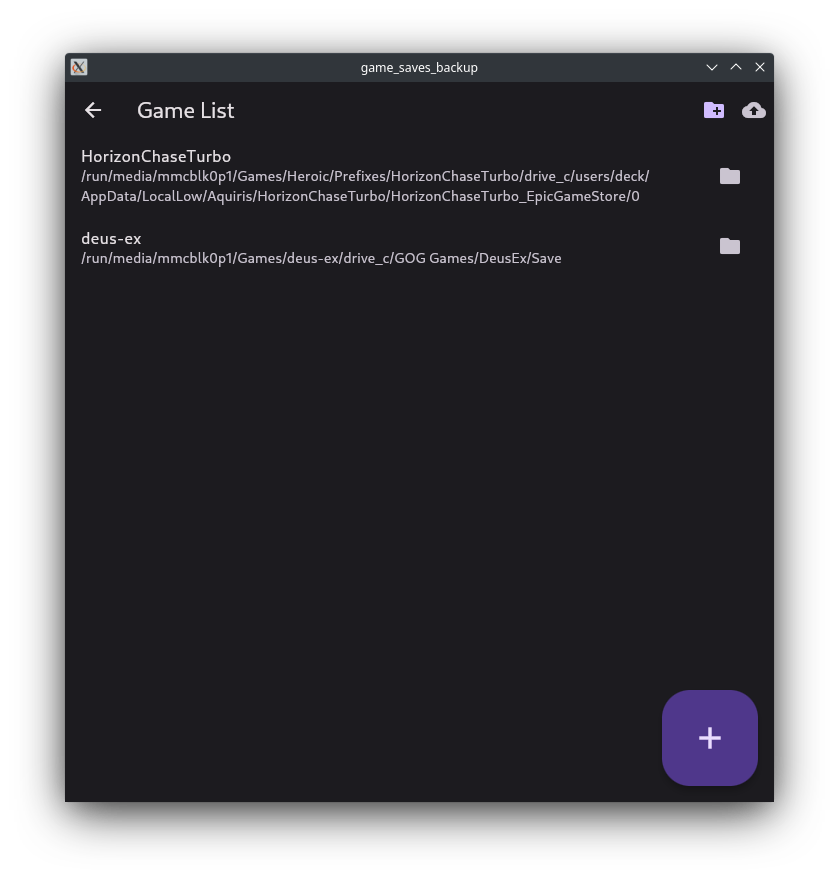
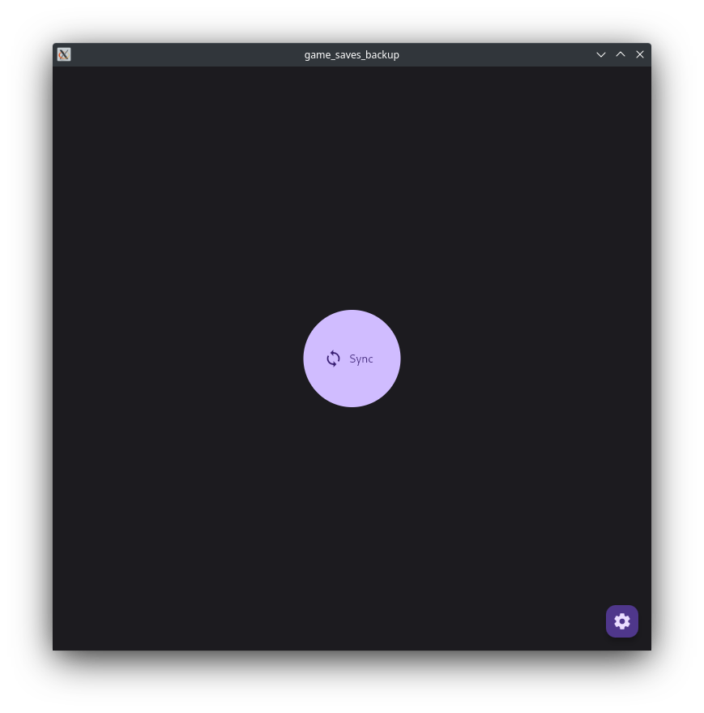
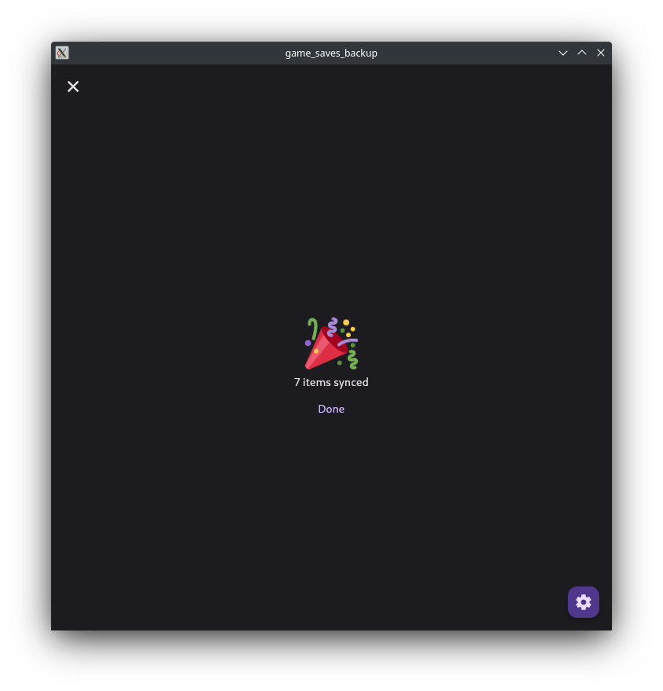

# game_saves_backup

A linux application to backup game saves.

## About

- Built for use on the steam deck (Game and Desktop mode)
- Compatible with Lutris, Heroic, Steam, Emulation etc.
- Individual game backup folder names can be customized
    - Inside prefixes, folder name defaults to prefix name
- Target Backup folder can be selected (defaults to `/home/deck/Downloads`)
- Each sync can either overwrite existing backup or creates a new backup
- Minimal, easy to use interface

<table>
<tr>
<td></td>
<td></td>
<td></td>
</tr>
</table>

Not sure where game save files are located? Take a look at the [PC Gaming Wiki](https://www.pcgamingwiki.com/).

Looking for more functionality? Check out [ludusavi](https://github.com/mtkennerly/ludusavi).

## Releases

The latest release can be found [here](https://github.com/defuncart/game_saves_backup/releases/latest). 

In desktop mode, the application can be added to Steam Launcher as a Non-Steam game via content menu, Lutris or Heroic.

### Building from Source

If you wish to build from source, you will require:

- Flutter >= 3.16
- Dart >= 3.2
- linux:
    - clang
    - ninja-build
    - libgtk-3-dev
    - libblkid-dev

The application has not been tested on windows, however it *should™* theoretically work. To generate relevant flutter project files, firstly run `fvm flutter create . --platforms=macos,windows`.

## Motivation

I've encountered some issues in which saves for a particular game via emulation are corrupted, or when upgrading proton version for a Heroic prefix, the save data is lost. The goal of this project is to provide a easy way to backup your most important game saves easily. As this is a personal project, currently there is no roadmap, however new features may be developed when deemed required.

## Notes

- The backup items database is stored at `/home/deck/Documents/game_saves_backup`. Do not delete any files in this folder.

## Known Issues

- On Steam Deck Desktop Mode, 'open' game save folder does not work
- On Steam Deck Desktop Mode, back up folder opens to `/home/deck`, even though real path is saved (i.e. `/home/deck/desktop`).

## Raising Issues and Contributing

Please report bugs and issues [here](https://github.com/defuncart/game_saves_backup/issues).

To contribute, submit a PR with a detailed description and tests, if applicable.
